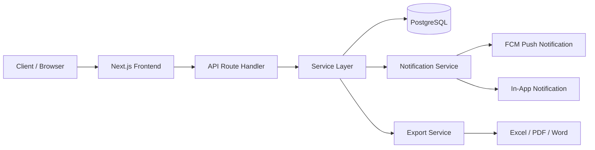
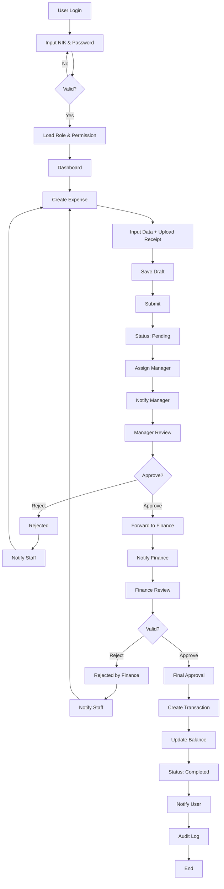
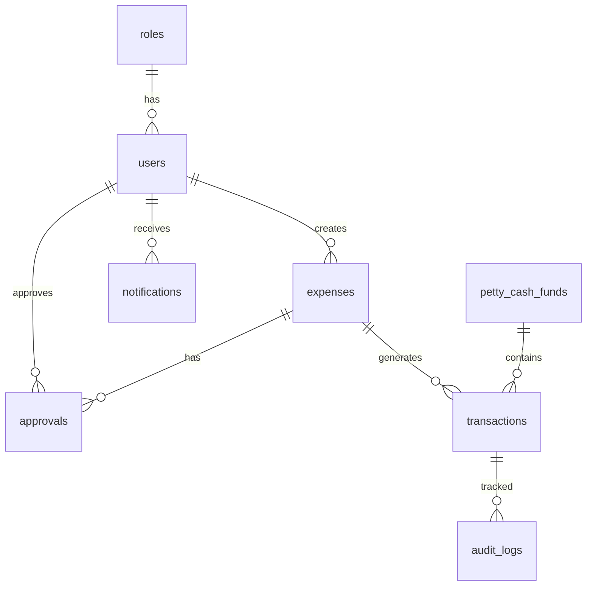

### *Smart Petty Cash Management System*

<p align="center">
  
  
  
  
  
  
</p>

---

## Overview

**Cashra** adalah sistem manajemen petty cash berbasis web yang dirancang untuk memberikan kontrol penuh terhadap pengeluaran operasional secara:

* **Real-time**
* **Terstruktur**
* **Audit-ready**
* **Scalable (multi-user & multi-branch)**

Dibangun dengan arsitektur modern dan siap production.

---

## Key Features

* NIK-based Authentication + RBAC
* Expense Submission & Tracking
* Multi-Level Approval Workflow
* Fund & Balance Management
* Real-time Notification (In-app + Push)
* Export (Excel, PDF, Word)
* Audit Trail (Immutable Logs)

---

## Tech Stack

| Layer        | Technology                          |
| ------------ | ----------------------------------- |
| Frontend     | Next.js, React, TailwindCSS, ShadCN |
| Backend      | Next.js API Route + Service Layer   |
| Database     | PostgreSQL                          |
| ORM          | Prisma                              |
| Notification | Firebase Cloud Messaging            |
| Export       | ExcelJS, PDF-lib, Puppeteer, DOCX   |

---

## System Architecture



---

## Main Workflow (End-to-End)



---

## Database Core Entities



---

## Role-Based Access Control (RBAC)

| Role    | Access Level                     |
| ------- | -------------------------------- |
| Admin   | Full system control              |
| Finance | Final approval + fund management |
| Manager | Approval level                   |
| Staff   | Submit expense                   |
| Auditor | Read-only + audit                |

---

## Project Structure

```bash
/app/api
  /auth
  /expenses
  /approvals
  /transactions
  /notifications
  /export

/services
  authService
  expenseService
  approvalService
  notificationService
  exportService

/middleware
  authMiddleware
  rbacMiddleware
```

---

## Engineering Principles

* Atomic DB Transaction (financial safety)
* Strict validation (Zod)
* Clean architecture (service layer separation)
* No business logic in controller
* Async queue for notification

---

## Getting Started

### 1. Clone Repository

```bash
git clone https://github.com/your-username/cashra.git
cd cashra
```

### 2. Install Dependencies

```bash
npm install
```

### 3. Environment Setup

```env
DATABASE_URL=
NEXTAUTH_SECRET=
FCM_SERVER_KEY=
```

### 4. Run Migration

```bash
npx prisma migrate dev
```

### 5. Run App

```bash
npm run dev
```

---

## Export Capability

* Excel (.xlsx)
* PDF (.pdf)
* Word (.docx)

```ts
generateExcel(data)
generatePDF(data)
generateWord(data)
```

---

## Use Cases

* Manufacturing
* Logistics
* Retail
* Consulting
* Technology
* NGO

---

## Roadmap

* [ ] Multi-branch analytics
* [ ] PWA / Mobile support
* [ ] AI anomaly detection
* [ ] Budget forecasting

---

## Contributing

Pull request terbuka.
Ikuti standar arsitektur dan coding yang sudah ditetapkan.

---
